# Ayush Singh

I build infrastructure that makes LLM and agent systems reliable: evaluation harnesses, trace replay, failure diagnosis, and runtime observability.

Most AI systems are judged on how they look when they succeed. I am more interested in what they do when they fail, and whether that failure can be reproduced, explained, and caught again before it ships.

<picture>
  <source media="(prefers-color-scheme: dark)" srcset="assets/trace-replay-dark.svg" />
  <source media="(prefers-color-scheme: light)" srcset="assets/trace-replay-light.svg" />
  
</picture>

## Research Direction

- Failure analysis and diagnostics for LLM agents
- Evaluation harnesses and regression testing across prompt, model, and tool changes
- Trace replay and execution-level debugging of agent runs
- Observability for GenAI systems in production
- Compiler-inspired program analysis applied to agent behavior

## Engineering Philosophy

The systems I build aim to be:

- observable before autonomous
- measurable before impressive
- reproducible before optimized
- evaluated on behavior, not benchmark scores

## Current Work

Reliability infrastructure for AI agents: trace replay, failure diagnosis, prompt and tool regression testing, evaluation harnesses, and runtime observability.

Pinned repositories below show the current state of that work.

## Contact

[Portfolio](https://portfolio.ayushsingh355vns.workers.dev/) · [LinkedIn](https://linkedin.com/in/ayush-singh-27a589285) · [Email](mailto:ayushsingh15vns@gmail.com)
